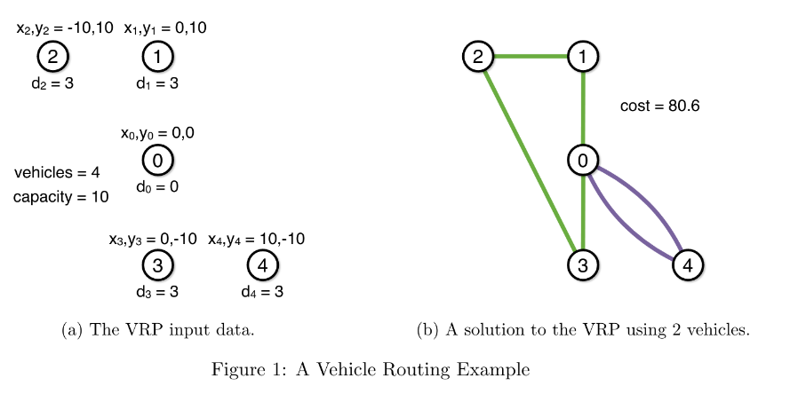

# Projeto20
Otimização de rotas de veículos com CVXPY

Otimização com CVXPY. Esta é uma tarefa do curso Otimização Discreta- https://www.coursera.org/learn/discrete-optimization/ O arquivo handout.pdf possui a descrição completa do problema e do formato de dados de entrada

Otimização de rotas de veículos.

O problema fornece a localização x,y de n clientes e um armazém de distribuição com m veículos. Cada cliente possui uma demanda 'Di' a ser atendida, cada veículo no armazém possui uma capacidade máxima de atendimento 'Ci'. O objetivo é otimizar a seleção de veículos de forma a atender todos os clientes existentes, minimizando
o somatório de distâncias percorrida por cada veículo. A capacidade máxima de atendimento de cada veículo não deve ser superada pelo somatório de demandas de clientes Di que estão em cada rota dos veículos.

Fig 1. Descriçao
    

Instruções:

Instale cvxpy digitando no terminal: python -m pip install cvxpy

Se quiser utilizar apenas o otimizador SCIP, que é gratuito,troque no código a palavra GUROBI por SCIP. Gurobi é
bem mais rápido, mas caso não queria instala-lo ou não tenha uma licença é a única opção.

Instale o SCIP: https://github.com/scipopt/PySCIPOpt 
ou use um container docker com SCIP: https://viktorsapozhok.github.io/docker-scip-pyscipopt/

Digite no terminal: python -m pip install pyscipopt

Instale o Gurobi pelo terminal: python -m pip install gurobipy

Para rodar: python solver.py vrp_51_5_1

Talvez voce precise de uma licença do Gurobi, no caso de problemas muito grandes

