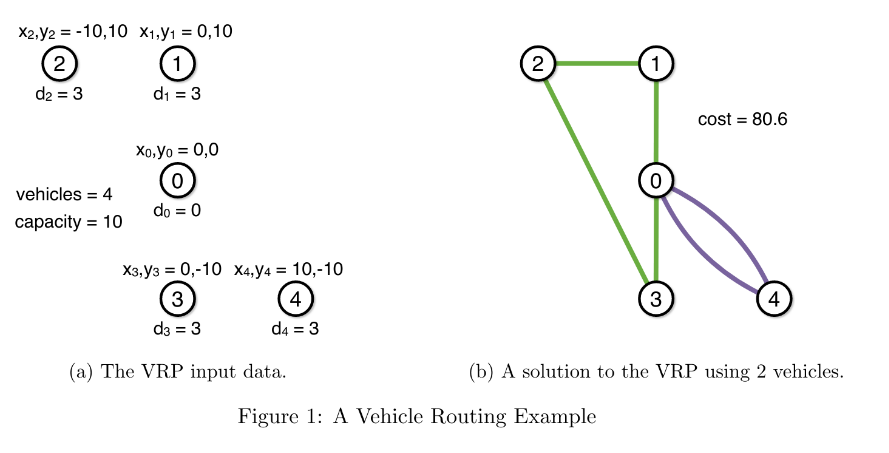

# Projeto20

# 1. Otimização de Rotas de Veículos com CVXPY

<p align="justify">
Este projeto implementa uma solução para o <b>Vehicle Routing Problem (VRP)</b> utilizando uma combinação de heurísticas construtivas e otimização matemática com <b>CVXPY</b>. O problema consiste em definir rotas para uma frota de veículos que parte de um depósito central para atender um conjunto de clientes distribuídos geograficamente, respeitando a capacidade máxima de carga de cada veículo e minimizando a distância total percorrida.
</p>

<p align="justify">
Esta implementação foi desenvolvida como parte do curso <b>Discrete Optimization</b> da Coursera. O algoritmo combina uma heurística gulosa para construir rapidamente uma solução inicial, modelos de programação inteira para otimizar a sequência de visitas em cada rota e um modelo adicional para redistribuição de clientes quando a solução inicial não consegue atender todas as demandas.
</p>



<p align="center">
Fig. 1 – Problema de Roteamento de Veículos (VRP)
</p>

---

# 2. Problema Resolvido

<p align="justify">
A entrada do algoritmo consiste em um depósito central e um conjunto de clientes. Cada cliente possui uma demanda específica e uma posição no plano cartesiano representada pelas coordenadas <i>x</i> e <i>y</i>. A frota é composta por um número fixo de veículos, todos com capacidade máxima de transporte previamente definida.
</p>

<p align="justify">
O objetivo é construir rotas para todos os veículos de forma que cada cliente seja atendido exatamente uma vez, nenhuma capacidade seja excedida e a distância total percorrida pela frota seja a menor possível.
</p>

---

# 3. Estrutura dos Dados

<p align="justify">
Cada cliente é representado pela estrutura <code>Customer</code>, que armazena seu identificador, demanda e coordenadas espaciais. O cliente de índice zero representa sempre o depósito de distribuição.
</p>

<p align="justify">
A função <code>length()</code> calcula a distância Euclidiana entre dois clientes, enquanto a rotina de leitura interpreta o arquivo de entrada contendo:
</p>

- número de clientes;
- número de veículos;
- capacidade dos veículos;
- demanda e coordenadas de cada cliente.

---

# 4. Construção Inicial das Rotas

<p align="justify">
A solução inicial é construída utilizando uma heurística gulosa baseada em proximidade geográfica.
</p>

<p align="justify">
Cada veículo inicia sua rota no depósito. Enquanto existir capacidade disponível, são considerados apenas os clientes cuja demanda ainda pode ser acomodada no veículo. Entre esses clientes elegíveis, é escolhido aquele que possui a menor distância em relação à posição atual do veículo.
</p>

<p align="justify">
Após cada seleção, a capacidade disponível é atualizada e o processo continua até que nenhum novo cliente possa ser inserido. Finalmente, o veículo retorna ao depósito.
</p>

<p align="justify">
Essa estratégia produz soluções rapidamente, embora não garanta a distância mínima global.
</p>

---

# 5. Classe Node

<p align="justify">
A classe <code>Node</code> representa o estado parcial de uma rota. Cada conexão entre dois clientes atualiza simultaneamente:
</p>

- distância acumulada;
- demanda acumulada;
- sequência de clientes visitados.

<p align="justify">
Essa estrutura simplifica o cálculo incremental das rotas durante toda a execução do algoritmo.
</p>

---

# 6. Otimização da Sequência de Visitas

<p align="justify">
Após definir quais clientes pertencem a cada veículo, o algoritmo resolve um problema clássico do Caixeiro Viajante (Travelling Salesman Problem - TSP) para determinar a melhor ordem de visita dentro de cada rota.
</p>

<p align="justify">
O modelo é implementado em <b>CVXPY</b> utilizando a formulação de Miller-Tucker-Zemlin (MTZ), que elimina subciclos através de variáveis auxiliares.
</p>

<p align="justify">
São utilizadas duas classes principais de variáveis:
</p>

- <code>x(i,j)</code>: indica se a rota segue diretamente do cliente <i>i</i> para o cliente <i>j</i>;
- <code>u(i)</code>: representa a posição de cada cliente na sequência da rota.

<p align="justify">
O objetivo consiste em minimizar a soma das distâncias percorridas mantendo uma única rota conectada entre todos os clientes selecionados.
</p>

---

# 7. Redistribuição de Clientes com Programação Inteira

<p align="justify">
Caso a heurística gulosa não consiga atender todos os clientes, o algoritmo executa uma segunda etapa baseada em otimização inteira.
</p>

<p align="justify">
É construída uma matriz binária onde cada linha representa um veículo e cada coluna representa um cliente. Cada elemento da matriz indica se determinado cliente será atendido por um veículo específico.
</p>

<p align="justify">
O modelo impõe simultaneamente as seguintes restrições:
</p>

- cada cliente pode ser atendido por no máximo um veículo;
- a soma das demandas atribuídas a um veículo não pode ultrapassar sua capacidade;
- deve ser atendido um número mínimo de clientes;
- o primeiro veículo inicia sua rota no depósito.

<p align="justify">
O objetivo é maximizar a demanda atendida e, posteriormente, selecionar a solução que apresenta a menor distância total percorrida.
</p>

---

# 8. Fluxo Completo do Algoritmo

<p align="justify">
O algoritmo segue as seguintes etapas principais:
</p>

1. leitura dos clientes e parâmetros da instância;
2. construção de rotas utilizando heurística gulosa;
3. verificação de clientes não atendidos;
4. redistribuição utilizando programação inteira, quando necessário;
5. otimização da ordem de visita de cada veículo através do TSP;
6. cálculo da distância total percorrida;
7. geração das rotas finais.

---

# 9. Formato da Saída

<p align="justify">
O resultado produzido segue o formato tradicional utilizado em competições de otimização.
</p>

```text
distancia_total 0
0 rota_veiculo_1 0
0 rota_veiculo_2 0
...
```

<p align="justify">
Cada rota inicia e termina obrigatoriamente no depósito representado pelo cliente de índice zero.
</p>

---

# 10. Complexidade Computacional

<p align="justify">
A heurística gulosa possui baixo custo computacional e permite gerar rapidamente uma solução viável para instâncias grandes.
</p>

<p align="justify">
Entretanto, a etapa de otimização da sequência de visitas utiliza Programação Inteira Mista para resolver um problema do Caixeiro Viajante em cada rota. Como o TSP é um problema NP-Difícil, o tempo de processamento cresce rapidamente conforme aumenta o número de clientes em cada veículo.
</p>

<p align="justify">
Por esse motivo, a abordagem é mais indicada para instâncias pequenas ou médias, nas quais a melhoria obtida na qualidade das rotas compensa o maior custo computacional.
</p>

---


# 11. Instalação

<p align="justify">
Instale o CVXPY:
</p>

```bash
python -m pip install cvxpy
```

<p align="justify">
Caso utilize apenas o solver gratuito SCIP, substitua no código todas as ocorrências de <code>GUROBI</code> por <code>SCIP</code>.
</p>

```bash
python -m pip install pyscipopt
```

<p align="justify">
Para utilizar o Gurobi:
</p>

```bash
python -m pip install gurobipy
```

<p align="justify">
Dependendo do tamanho do problema, pode ser necessária uma licença válida do Gurobi.
</p>

---

# 12. Execução

```bash
python solver.py vrp_51_5_1
```

---

# 13. Conclusão

<p align="justify">
Este projeto implementa uma abordagem híbrida para o Problema de Roteamento de Veículos, combinando uma heurística gulosa para construção rápida das rotas com modelos de Programação Inteira para refinar tanto a distribuição dos clientes entre os veículos quanto a sequência de visitas em cada rota. Essa estratégia produz soluções de boa qualidade em tempo reduzido quando comparada à resolução exata do problema completo. Embora a etapa de otimização do TSP aumente significativamente o custo computacional para instâncias maiores, a combinação entre heurísticas e otimização matemática oferece um excelente equilíbrio entre desempenho e qualidade das soluções, demonstrando na prática a aplicação de técnicas modernas de Pesquisa Operacional e Otimização Combinatória em problemas reais de logística e distribuição.
</p>
````
